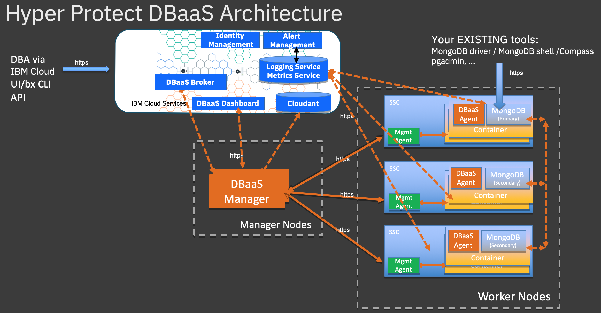

---

copyright:
  years: 2019
lastupdated: "2019-08-28"

keywords: Hyper Protect DBaaS, database, data security

subcollection: hyper-protect-dbaas-for-mongodb

---

{:shortdesc: .shortdesc}
{:codeblock: .codeblock}
{:important: .important}
{:screen: .screen}
{:codeblock: .codeblock}
{:tip: .tip}
{:pre: .pre}
{:note: .note}
{:external: target="_blank" .external}

# About {{site.data.keyword.cloud_notm}} {{site.data.keyword.ihsdbaas_full}}
{: #overview}

Moving confidential and mission critical data to the cloud presents data confidentiality, security, and reliability concerns. {{site.data.keyword.cloud}} {{site.data.keyword.ihsdbaas_full}} offers highly secure database environments for enterprise workloads with sensitive data.
{:shortdesc: .shortdesc}

## Why {{site.data.keyword.cloud_notm}} {{site.data.keyword.ihsdbaas_full}}?
{: #why_hpdb}

Built on {{site.data.keyword.IBM_notm}} LinuxONE technology, {{site.data.keyword.cloud_notm}} {{site.data.keyword.ihsdbaas_full}} provides built-in encryption and tamper protection for data at rest with excellent vertical scalability and performance. With this leading-edge solution, you can deploy your workloads with sensitive data in a highly secure and easy-to-use enterprise cloud database environment. It ensures complete data confidentiality and grants data owners complete control over the data, protecting data from both external and internal threats.

## How does {{site.data.keyword.cloud_notm}} {{site.data.keyword.ihsdbaas_full}} work?
{: #how_hpdb_works}

The following architectural diagram shows how {{site.data.keyword.cloud_notm}} {{site.data.keyword.ihsdbaas_full}} (for {{site.data.keyword.mongodb}} as an example) works.
{: caption="Figure 1. {{site.data.keyword.ihsdbaas_full}} architecture" caption-side="bottom"}

## Features
{: #features}

### Data confidentiality
{{site.data.keyword.IBM_notm}} LinuxONE Secure Service Container (SSC) provides workload isolation, restricted administrator access and tamper protection. The service allows data owners to maintain complete control over their data in the cloud, and no one, including the cloud administrator, has access to customer data at any point.

### Fully managed
{{site.data.keyword.cloud_notm}} {{site.data.keyword.ihsdbaas_full}} offers non-disruptive version upgrades and around-the-clock support from {{site.data.keyword.cloud_notm}}. Developers can focus on building applications rather than managing availability, backups, logging, monitoring, scaling, hardware setup, and software patching.

### Highly available
Every {{site.data.keyword.cloud_notm}} {{site.data.keyword.ihsdbaas_full}} deployment is built as a highly available clustered configuration. Three node clusters are available for each deployed instance hosted on LinuxONE in a Multi-Zone Region (MZR) setup within an {{site.data.keyword.cloud_notm}} Region, with automatic daily backups in the local storage.

### Developer friendly
{{site.data.keyword.cloud_notm}} {{site.data.keyword.ihsdbaas_full}} provides standardized APIs to provision, manage, maintain, and monitor {{site.data.keyword.mongodb}} EA and {{site.data.keyword.postgresql}} databases. For developers, it is easy to get started without the need to have specialized DBA skills.
